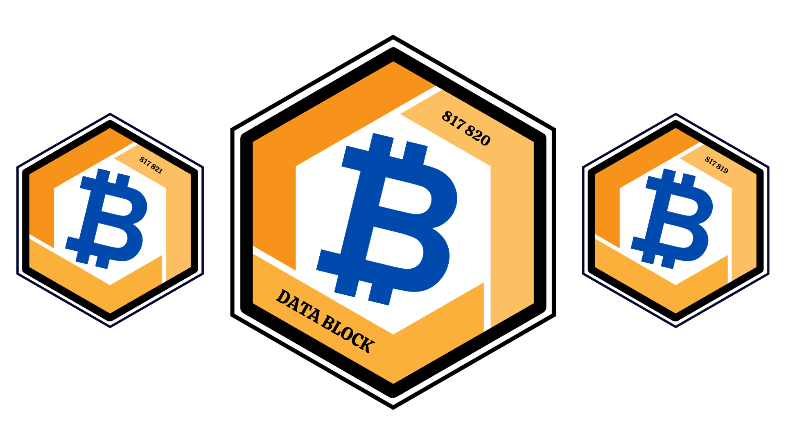

Data Block

Bienvenue dans le projet Data Block, une application conçue pour les microcontrôleurs ESP32, en particulier le modèle Lilygo T-Display S3. Ce projet offre une interface conviviale pour afficher des informations en temps réel sur la Timechain Bitcoin, telles que la hauteur du bloc, les frais de transaction et bien plus encore.

Fonctionnalités

Affichage des informations Bitcoin : Obtenez des données cruciales sur le réseau Bitcoin, notamment la hauteur du bloc et les frais de transaction actuels (faible, moyen, élevé).
Exploration des derniers blocs : Explorez les détails des trois derniers blocs avec une interface inspirée de mempool.space.
Compte à rebours personnalisable : Configurez des événements spéciaux avec un compte à rebours stylisé, comme illustré par l'exemple du BEF (18/05/2024).

Configuration Wi-Fi

Au démarrage, l'ESP32 tente de se connecter automatiquement au dernier réseau Wi-Fi enregistré. Si aucun réseau n'est trouvé, il crée un point d'accès Wi-Fi auquel vous pouvez vous connecter pour configurer les paramètres Wi-Fi depuis votre téléphone.

Utilisation

Premier écran : Affichez les informations principales en cliquant sur le bouton inférieur. L'écran comprend des détails tels que la hauteur du bloc et les frais de transaction actuels, ainsi qu'une image/logo sur la partie droite.

Exploration des blocs : En cliquant rapidement sur le bouton inférieur une seconde fois, explorez les détails des trois derniers blocs dans une interface inspirée de mempool.space.

Compte à rebours : Un clic long sur le bouton inférieur ramène à l'écran principal, tandis qu'un clic court permet de visualiser un compte à rebours personnalisé pour des événements spéciaux.

Versions personnalisées

Le projet propose des versions personnalisées, telles que la version BEF et la version Seigneur des Anneaux (LOTR). Pour basculer entre ces versions, commentez le fichier "DataBlock.cpp" et décommentez la version de votre choix dans le dossier "src/editions".
Configuration

Pour démarrer, téléversez le firmware sur votre ESP32.

Note : Pour des versions plus personnalisées, consultez les fichiers correspondants dans le dossier "src/editions". 

Profitez de l'exploration de la Timechain Bitcoin avec Data Block ! 🚀
