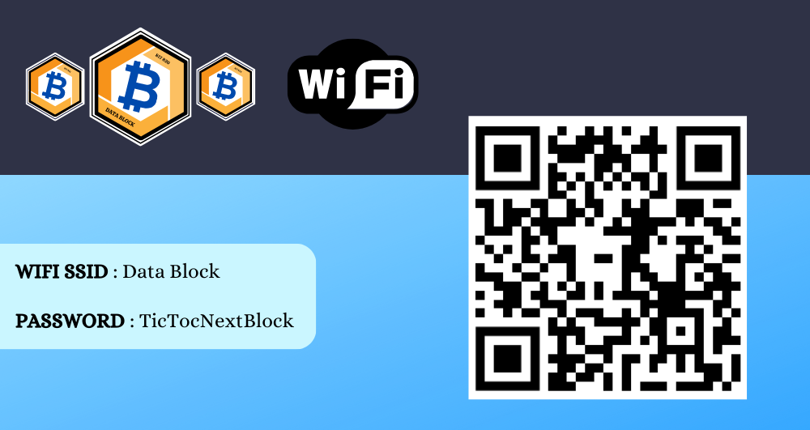
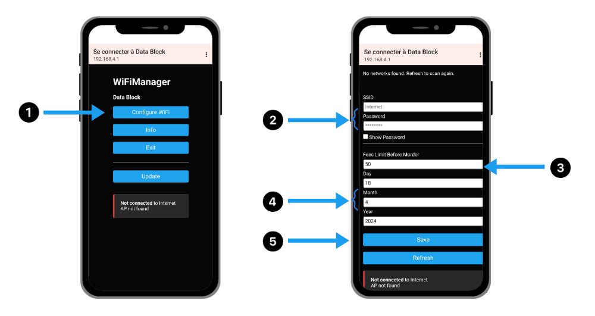
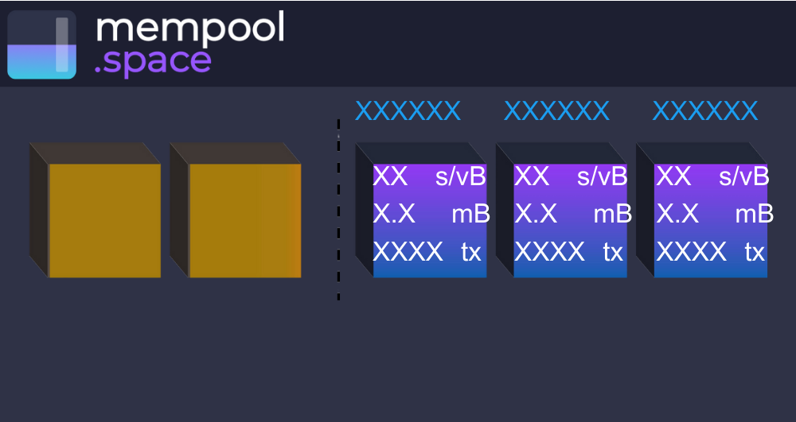
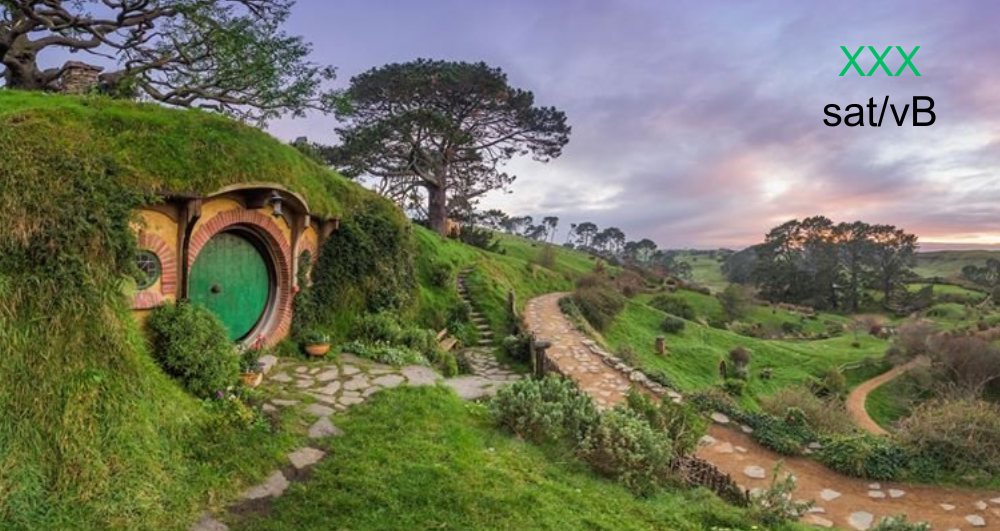
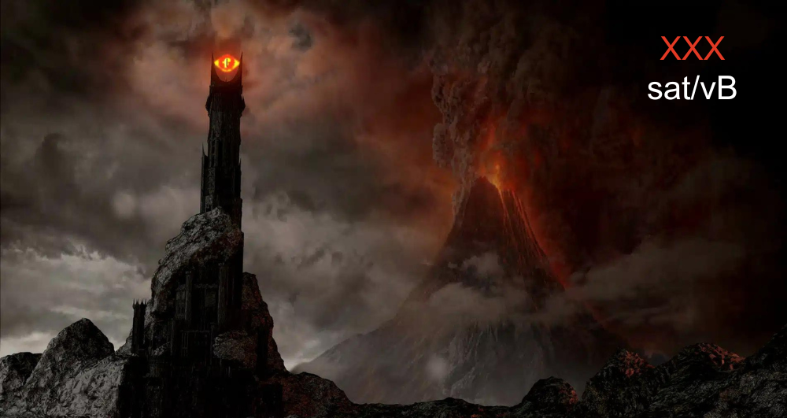
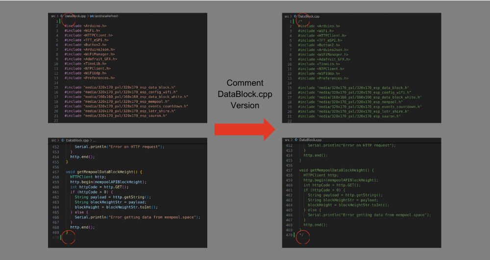
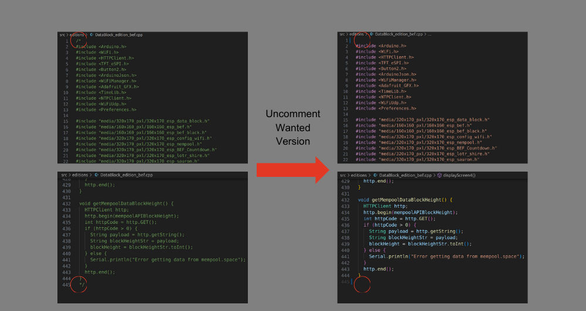

# Data Block

## Introduction

Welcome to the Data Block project, an application designed for ESP32 microcontrollers, specifically the Lilygo T-Display S3 model. Explore the Bitcoin Timechain with a user-friendly interface displaying real-time information such as block height, transaction fees, and much more.

## Features

- **Bitcoin Information Display**: Get crucial data about the Bitcoin network, including current block height and transaction fees (low, medium, high).
- **Explore Latest Blocks**: Dive into details of the three latest blocks with an interface inspired by mempool.space.
- **Customizable Countdown**: Set up special events with a stylized countdown, as illustrated by the BEF example (18/05/2024).
- **"Limit Fees"**: Displays 2 different screens based on the chosen limit for medium fees.

## Wi-Fi Configuration

On startup, the ESP32 attempts to automatically connect to the last registered Wi-Fi network. If no network is found, it creates a Wi-Fi access point that you can connect to and configure Wi-Fi settings from your phone.

### Wi-Fi Configuration Steps:

1. Click "Configure WiFi" to access a new page.
2. Fill in the information regarding Wi-Fi.
3. Set the limit for fees in sat/vB before Mordor.
4. Set the date for event display.
5. Click "Save" to save the configuration.

## Usage

Quickly click the bottom button to display the next screen. A long press on the bottom button will take you back to the first screen.

- **First Screen**: Displays main information such as block height and current transaction fees.
  

- **Explore Blocks**: Dive into the details of the three latest blocks in an interface inspired by mempool.space (https://mempool.space/en/).
  

- **Countdown**: Displays a customized countdown for special events.
  

- **Limit Fees**: Depending on the configuration in the Wi-Fi portal, arrive at this screen where the Shire or Mordor will be displayed with medium fees.
  
  

## Custom Versions

The project offers custom versions such as the BEF version and the Lord of the Rings (LOTR) version. To switch between these versions :
- comment out the "DataBlock.cpp" file
  
- uncomment the version of your choice in the "src/editions" folder.
  

## Configuration

To start, upload the firmware to your ESP32.

**Note**: For more customized versions, check the corresponding files in the "src/editions" folder.

## Tips

If you've enjoyed the project and would like to show your appreciation, feel free to buy me a coffee :
⚡ 0xscuba@getalby.com.

Every sip supports the code! ☕️

Enjoy exploring the Bitcoin Timechain with Data Block! 🚀
